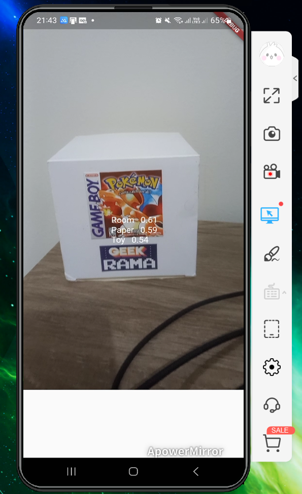

[![Contributors][contributors-shield]][contributors-url]
[![Forks][forks-shield]][forks-url]
[![Stargazers][stars-shield]][stars-url]
[![Issues][issues-shield]][issues-url]
[![GNU License][license-shield]][license-url]
[![LinkedIn][linkedin-shield]][linkedin-url]

[contributors-shield]: https://img.shields.io/github/contributors/rafaelqueiroz88/FlutterRealTimeImageLabeling.svg?style=for-the-badge
[contributors-url]: https://github.com/rafaelqueiroz88/FlutterRealTimeImageLabeling/graphs/contributors
[forks-shield]: https://img.shields.io/github/forks/rafaelqueiroz88/FlutterRealTimeImageLabeling?style=for-the-badge
[forks-url]: https://github.com/rafaelqueiroz88/FlutterRealTimeImageLabeling/network/members
[stars-shield]: https://img.shields.io/github/stars/rafaelqueiroz88/FlutterRealTimeImageLabeling?style=for-the-badge
[stars-url]: https://github.com/rafaelqueiroz88/FlutterRealTimeImageLabeling/stargazers
[issues-shield]: https://img.shields.io/github/issues/rafaelqueiroz88/FlutterRealTimeImageLabeling.svg?style=for-the-badge
[issues-url]: https://github.com/rafaelqueiroz88/FlutterRealTimeImageLabeling/issues
[license-shield]: https://img.shields.io/github/license/rafaelqueiroz88/FlutterRealTimeImageLabeling.svg?style=for-the-badge
[license-url]: https://github.com/rafaelqueiroz88/FlutterRealTimeImageLabeling/blob/master/LICENSE
[linkedin-shield]: https://img.shields.io/badge/-LinkedIn-black.svg?style=for-the-badge&logo=linkedin&colorB=555
[linkedin-url]: https://www.linkedin.com/in/rafael-queiroz-0074a4139/

<br />

# Image Reading

<table border="0">
  <tr>
    <td align="center">
      
    </td>
    <td>
      <h2>Resume</h2>
      This is a simple Image Reader App build with Flutter. This App can read phone live camera, and make it's classification. Just need to point camera to anything and then the image will be classified and described.<br /><br />
      <hr />
      <h2>Getting Started</h2>
      This project count on Google ML Kit Image Labelling.
      Since Google ML Kit is installed. Check <code>pubspec.yml</code> to check these libraries and then run the follow command:<br /><br />
      ```
      flutter pub get
      ```
    </td>
  </tr>
</table>

<br />

## About the Project

This project has no back-end project, but uses Firebase to manage app features. Make sure to have internet connection to access.<br /><br />

<table border="0">
  <tr>
    <td>
      
    </td>
    <td>
      Dart is the main language in this project since there are no back-end server to provide data.
    </td>
  </tr>
  <tr>
    <td>
      
    </td>
    <td>
      This project counts on Flutter since Flutter is the most popular Dart Framework.
    </td>
  </tr>
  <tr>
    <td>
      
    </td>
    <td>
      As a sample project, Firebase is set to provide and controlls data.
    </td>
  </tr>
</table>

<br />

<!-- Project Shields -->
[![Contributors][contributors-shield]][contributors-url]
[![Forks][forks-shield]][forks-url]
[![Stargazers][stars-shield]][stars-url]
[![Issues][issues-shield]][issues-url]
[![GNU License][license-shield]][license-url]
[![LinkedIn][linkedin-shield]][linkedin-url]
